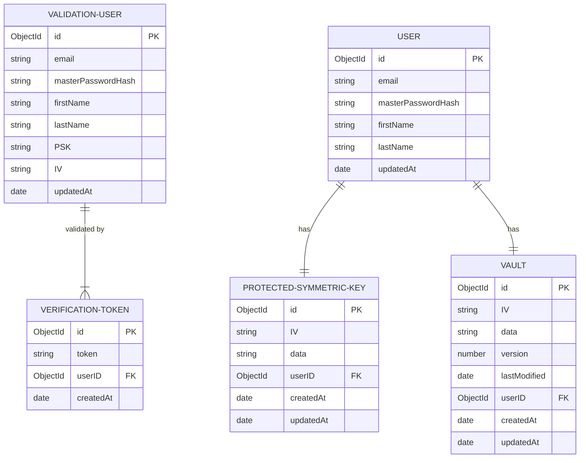

# MongoDB

## Database ER Diagram

## Mongoose models

### Legend

✅ Required  
❌ Not required  
⚙️ Property added automatically

## User

Stored in the 'Users' collection, where all authentication and profile management occurs

### SCHEMA

| Property name | Type | Required | Unique | Description |
| :-----------: | ---- | :------: | :------: | ------------ |
| email | String | ✅ | ✅ | Server side validation before account activation. Not updatable (for now) |
| masterPasswordHash | String | ✅ | ❌ | Stored as bcrypt hash. |
| firstName | String | ✅ | ❌ | Allowed lowercase, uppercase, single/multiple names with space and single quote |
| lastName | String | ✅ | ❌ | Allowed lowercase, uppercase, single/multiple names with space and single quote |
| createdAt | Date | ⚙️ | ❌ | Initialized at creation, never updated |
| updatedAt | Date | ⚙️ | ❌ | Updated each time the document is updated |
| _id | ObjectId | ⚙️ | ✅ | MongoDB ObjectId, saved in JWT token to identify users |

## User Verification

Stored in the 'UsersVerification' collection until verified, entries are deleted 4h after the last update  
When verified the data will be split and both a User and a Protected Symmetric Key entry will be created

### SCHEMA

| Property name | Type | Required | Unique | Description |
| :-----------: | ---- | :------: | :------: | ------------ |
| email | String | ✅ | ✅ | Server side validation before account activation. Not updatable (for now) |
| masterPasswordHash | String | ✅ | ❌ | Stored as bcrypt hash. |
| firstName | String | ✅ | ❌ | Allowed lowercase, uppercase, single/multiple names with space and single quote |
| lastName | String | ✅ | ❌ | Allowed lowercase, uppercase, single/multiple names with space and single quote |
| PSK | String | ✅ | ❌ | Symmetric Key encrypted/decrypted on client using AES-256-CBC, encoded as hex. |
| IV | String | ✅ | ❌ | Initialization Vector sent to the client for AES-256 decryption, encoded as hex |
| createdAt | Date | ⚙️ | ❌ | Initialized at creation, never updated |
| updatedAt | Date | ⚙️ | ❌ | Updated each time the document is updated |
| _id | ObjectId | ⚙️ | ✅ | MongoDB ObjectId, saved in JWT token to identify users |

## Verification Token

Stored in the 'VerificationTokens' collection, deleted when validation occurs or after 4h without use

### SCHEMA

| Property name | Type | Required | Unique | Description |
| :-----------: | ---- | :------: | :------: | ------------ |
| token | String | ✅ | ✅ | Generated as UUID V4 |
| userId | ObjectId | ✅ | ❌ | Reference to the user to activate. One token per user, new one replace old one |
| createdAt | Date | ⚙️ | ❌ | Initialized at creation, never updated, used to delete after 4h if not verified |
| _id | ObjectId | ⚙️ | ✅ | MongoDB ObjectId |

## Protected Symmetric Key

Stored in the 'ProtectedSymmetricKeys' collection

### SCHEMA

| Property name | Type | Required | Unique | Description |
| :-----------: | ---- | :------: | :------: | ------------ |
| userId | ObjectId | ✅ | ✅ | Reference to the owner of the key |
| IV | String | ✅ | ❌ | Initialization Vector sent to the client to decrypt the Symmetric Key, encoded as hex |
| data | String | ✅ | ❌ | Symmetric Key encrypted/decrypted on client using AES-256-CBC, encoded as hex |
| createdAt | Date | ⚙️ | ❌ | Initialized at creation, never updated |
| updatedAt | Date | ⚙️ | ❌ | Updated each time the document is updated |
| _id | ObjectId | ⚙️ | ✅ | MongoDB ObjectId |

## Vault

Stored in the 'Vaults' collection

### SCHEMA

| Property name | Type | Required | Unique | Description |
| :-----------: | ---- | :------: | :------: | ------------ |
| userId | ObjectId | ✅ | ✅ | Reference to the owner of the vault |
| version | Number | ✅ | ❌ | Version number of the vault. Always positive and only increments with each update. Updates with a version lower than the existing one are refused. |
| lastModified | Date | ✅ | ❌ | Client timestamp of last change to the data, used to compare versions between clients |
| IV | String | ✅ | ❌ | Initialization Vector sent to the client for AES-256 decryption, encoded as hex |
| data | String | ✅ | ❌ | Encrypted vault data, encoded as base64 |
| createdAt | Date | ⚙️ | ❌ | Initialized at creation, never updated |
| updatedAt | Date | ⚙️ | ❌ | Updated each time the document is updated |
| _id | ObjectId | ⚙️ | ✅ | MongoDB ObjectId |
