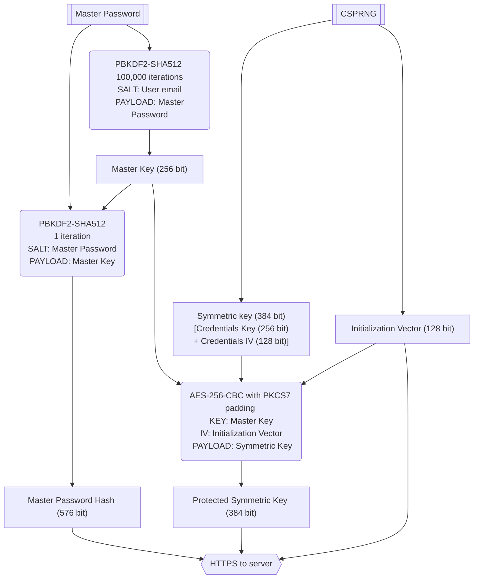
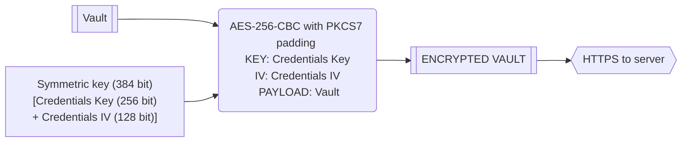
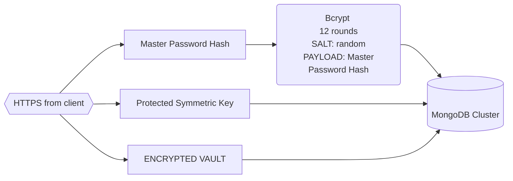

# Security whitepaper

## Client side

When a new account is created, PWM uses Password-Based Key Derivation Function 2 (PBKDF2-SHA512) with 100,000 iteration rounds
and a salt of the user's email to derive the 256 bit Master Key.
This Master Key is then expanded to 512 bit using HMAC-based Extract-and-Expand Key Derivation Function (HKDF) obtaining
the 256 bit Protection Master Key.  
Master Password, Master Key and Expanded Master Key are **NEVER** transmitted to or stored on our server, they are only
generated and used on the client.

To encrypt the credentials a 384 bit Symmetric Key and 128 bit Initialization Vector are generated using a
Cryptographically Secure Pseudorandom Number Generator (CSPRNG). The Symmetric Key is then encrypted using AES-256
encryption, the Initialization Vector and the Expanded Master Key to generate the Protected Symmetric Key.  
The 384 bit Symmetric Key is itself composed of a 256 bit Credentials Key and corresponding 128 bit Credentials IV that
are used in AES-256 encryption to encrypt the credentials vault. 
The Encrypted Vault is then uploaded to our servers
The Protected Symmetric Key the Initialization Vector and the Encrypted Vault are then sent to our server to be stored
until a new client syncs and retrieves them.  
The Symmetric Key or the Vault are **NEVER** transmitted to or stored on our server, they are only
generated and used on the client.

A Master Password Hash is also created using PBKDF2-SHA512 with a salt of Master Password and a payload of Master Key.
This Master Password Hash is sent then to our server over HTTPS.

### SYMMETRIC KEY SECURITY SCHEMA

### VAULT SECURITY SCHEMA

## Server side

We receive the Master Password Hash from the client over HTTPS and we hash it again using 12 rounds of Bcrypt and
a random salt saving the digest in our database to be used every time a user tries to authenticate.
The Protected Symmetric Key and the Encrypted Vault are also stored in our database to be sent to every client
that syncs with our servers.

### DATABASE SECURITY SCHEMA

