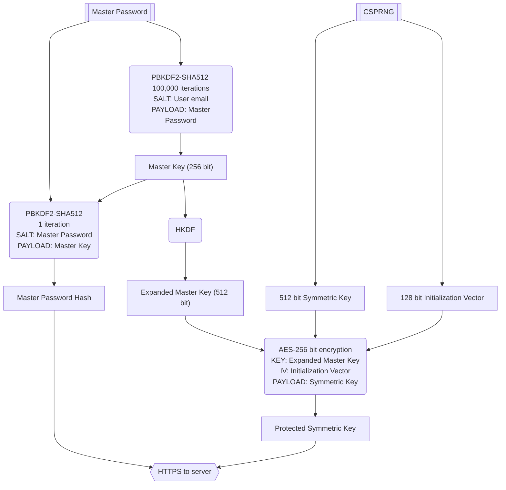
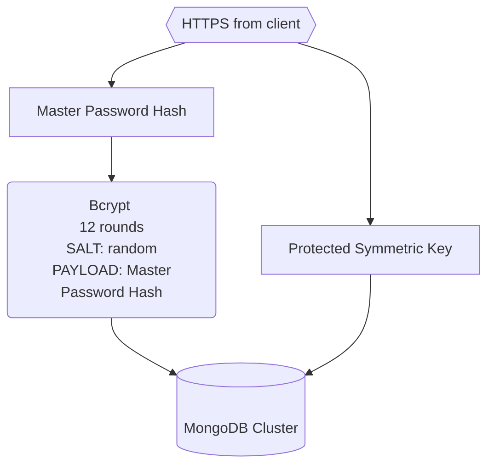

# Security whitepaper

## Client side

When a new account is created, PWM uses Password-Based Key Derivation Function 2 (PBKDF2-SHA512) with 100,000 iteration rounds
and a salt of the user's email to derive the 256 bit Master Key.
This Master Key is then expanded to 512 bit using HMAC-based Extract-and-Expand Key Derivation Function (HKDF) obtaining
the 512 bit Expanded Master Key.
Master Password, Master Key and Expanded Master Key are **NEVER** transmitted to or stored on our server, they are only
generated and used on the client.

To encrypt the credentials a 512 bit Symmetric Key and 128 bit Initialization Vector are generated using a
Cryptographically Secure Pseudorandom Number Generator (CSPRNG). The Symmetric Key is then encrypted using AES-256
encryption, the Initialization Vector and the Expanded Master Key to generate the Protected Symmetric Key.  
The Protected Symmetric Key is then sent to our server to be stored until a new client syncs and retrieves it.

A Master Password Hash is also created using PBKDF2-SHA512 with a salt of Master Password and a payload of Master Key.
This Master Password Hash is sent then to our server over HTTPS.

### SCHEMA

## Server side

We receive the Master Password Hash from the client over HTTPS and we hash it again using 12 rounds of Bcrypt and
a random salt saving the digest in our database to be used every time a user tries to authenticate.
The Protected Symmetric Key is also stored in our database to be synced with every new client that syncs with our servers.

